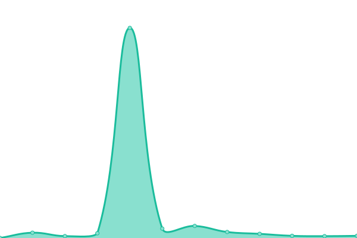
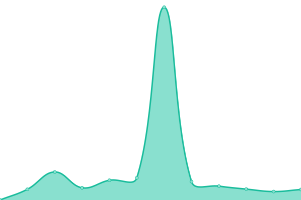
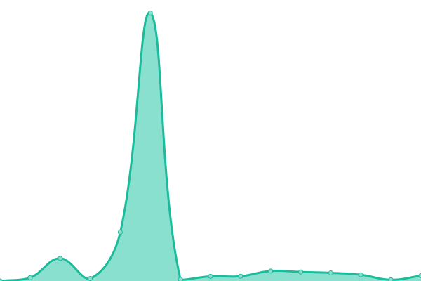

# [📈 Live Status](https://Nutreco.github.io/uptime-status): <!--live status--> **🟩 All systems operational**

This repository contains the open-source uptime monitor and status page for [Nutreco](https://Nutreco.github.io/uptime-status)-Skretting.

With [Upptime](https://upptime.js.org), you can get your own unlimited and free uptime monitor and status page, powered entirely by a GitHub repository. We use [Issues](https://github.com/Nutreco/uptime-status/issues) as incident reports, [Actions](https://github.com/Nutreco/uptime-status/actions) as uptime monitors, and [Pages](https://Nutreco.github.io/uptime-status) for the status page.

<!--start: status pages-->
<!-- This summary is generated by Upptime (https://github.com/upptime/upptime) -->
<!-- Do not edit this manually, your changes will be overwritten -->
<!-- prettier-ignore -->
| URL | Status | History | Response Time | Uptime |
| --- | ------ | ------- | ------------- | ------ |
|  [AquaSim Portal](https://aquasim.skretting.com) | 🟩 Up | [aqua-sim-portal.yml](https://github.com/Nutreco/uptime-status/commits/HEAD/history/aqua-sim-portal.yml) | 

 723ms
     
 | 

<a href="https://Nutreco.github.io/uptime-status/history/aqua-sim-portal">100.00%</a>
    

|  [SAM](https://sam.skretting.com) | 🟩 Up | [sam.yml](https://github.com/Nutreco/uptime-status/commits/HEAD/history/sam.yml) | 

 90ms
     
 | 

<a href="https://Nutreco.github.io/uptime-status/history/sam">100.00%</a>
    

|  [XMS](https://xms.skretting.com) | 🟩 Up | [xms.yml](https://github.com/Nutreco/uptime-status/commits/HEAD/history/xms.yml) | 

 876ms
     
 | 

<a href="https://Nutreco.github.io/uptime-status/history/xms">100.00%</a>
    

|  AquaSim Authorization | 🟩 Up | [aqua-sim-authorization.yml](https://github.com/Nutreco/uptime-status/commits/HEAD/history/aqua-sim-authorization.yml) | 

 658ms
     
 | 

<a href="https://Nutreco.github.io/uptime-status/history/aqua-sim-authorization">100.00%</a>
    

|  [APIM Developer](https://apim-developer.skretting.com) | 🟩 Up | [apim-developer.yml](https://github.com/Nutreco/uptime-status/commits/HEAD/history/apim-developer.yml) | 

 721ms
     
 | 

<a href="https://Nutreco.github.io/uptime-status/history/apim-developer">100.00%</a>
    

|  [AquaSim Portal UAT](https://aquasimuat.skretting.com) | 🟩 Up | [aqua-sim-portal-uat.yml](https://github.com/Nutreco/uptime-status/commits/HEAD/history/aqua-sim-portal-uat.yml) | 

 715ms
     
 | 

<a href="https://Nutreco.github.io/uptime-status/history/aqua-sim-portal-uat">100.00%</a>
    

|  [SAM UAT](https://samuat.skretting.com) | 🟩 Up | [sam-uat.yml](https://github.com/Nutreco/uptime-status/commits/HEAD/history/sam-uat.yml) | 

 59ms
     
 | 

<a href="https://Nutreco.github.io/uptime-status/history/sam-uat">100.00%</a>
    

<!--end: status pages-->

[**Visit our status website →**](https://Nutreco.github.io/uptime-status)

## 📄 License

- Powered by: [Upptime](https://github.com/upptime/upptime)
- Code: [MIT](./LICENSE) © [Nutreco](https://Nutreco.github.io/uptime-status)-Skretting
- Data in the `./history` directory: [Open Database License](https://opendatacommons.org/licenses/odbl/1-0/)
